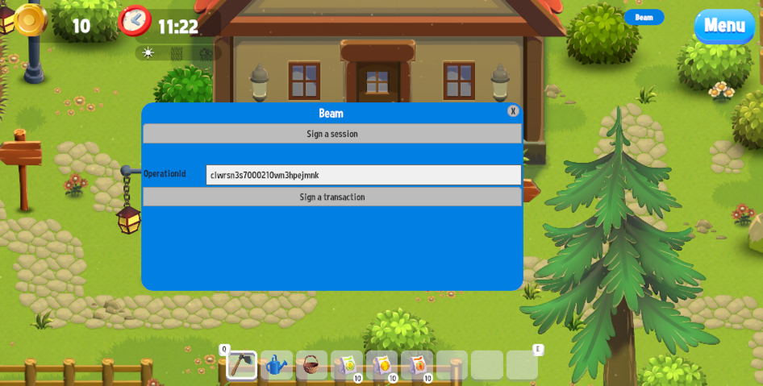

# Happy Harvest demo with Beam SDK

This is a free Happy Harvest demo made with unity 2022.3 from:  
https://assetstore.unity.com/packages/essentials/tutorial-projects/happy-harvest-2d-sample-project-259218

This demo integrates [Beam SDK Unity](https://github.com/Merit-Circle/beam-sdk-unity) to showcase how you can initialize Operation Signing and Sessions.

To open basic Beam dialog, click on `Beam` button in top right part of the screen. A new popup will appear:


## Docs
To read up on Sessions and Operations, please visit or [Player API docs](https://docs.onbeam.com/service/introduction-player-api).

## Setting up
Load the project via Unity Hub, add `scenes/MainMenu` or directly `scenes/Farm_Outdoor`.  

In order to use this example with your game, you need to set up two variables in [UIHandler.cs](https://github.com/Merit-Circle/beam-sdk-unity-example/blob/main/Assets/HappyHarvest/Scripts/UI/UIHandler.cs):
```csharp
public const string BeamEntityId = "entity-id-of-your-user";
public const string BeamPublishableApiKey = "your-publishable-api-key";
```

## BeamClient
The base of entire SDK is BeamClient class. It's a class that extends MonoBehaviour. so it needs to be initialized via GameObject or dependency injection framework of your choosing. 
```csharp
var beamClient = gameObject.AddComponent<BeamClient>()
                .SetBeamApiKey(BeamPublishableApiKey)
                .SetEnvironment(BeamEnvironment.Testnet);
```
## Session signing
To sign a session, you can press `Sign a session` which will open the browser for the User to perform a social login. You will receive a callback with result of signing via Beam SDK.
You can see code that handles this in [uIHandler.cs](https://github.com/Merit-Circle/beam-sdk-unity-example/blob/main/Assets/HappyHarvest/Scripts/UI/UIHandler.cs#L187)

## Signing operations
When performing an on-chain action in Beam Player API, you receive an Operation object in return. In order to actually perform the operation, you need to give us the Operation Id. We will either use existing, active session or open a browser for user to sign the operation.
Operation can consist of multiple on-chain transactions that need signing. We will handle all of that for you. You can see en example of that in [UIHandler.cs](https://github.com/Merit-Circle/beam-sdk-unity-example/blob/main/Assets/HappyHarvest/Scripts/UI/UIHandler.cs#L161)

