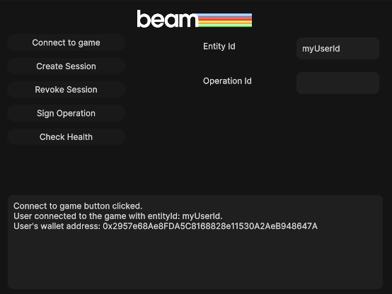
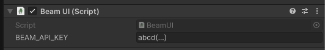

# Beam SDK Unity Example

This demo integrates [Beam SDK Unity](https://github.com/BuildOnBeam/beam-sdk-unity) to showcase how you can initialize Operation Signing and Sessions.



## Docs
To read up on Sessions and Operations, please visit or [Player API docs](https://docs.onbeam.com/service/introduction-player-api).

## Setting up
Load the project via Unity Hub, add `scenes/SampleScene` to your Hierarchy view.  

In order to use this example with your game, you need to set your Publishable Beam API Key on UIDocument:


Entire Beam SDK usage can be seen in [Assets/BeamUI.cs](Assets/BeamUI.cs) which sets up listeners and basic UI logic.

## Beam Unity SDK
You can find more info on Beam Unity SDK here:
[Beam SDK Unity](https://github.com/BuildOnBeam/beam-sdk-unity)

### Custom WebView
We have introduced an example of how you can use custom WebView plugin to use with Beam SDK.
In our case we used [gree/unity-webview](https://github.com/gree/unity-webview) which has its quirks and will not work on Windows. You can use any solution you want, all you really have to do it override URL Opener like this: 
```csharp
beamClient.SetUrlOpener(url => { InitWebview(url); });
```
To enable or disable WebView you can use the boolean `USE_WEB_VIEW` on Beam UI Script within UIDocument.